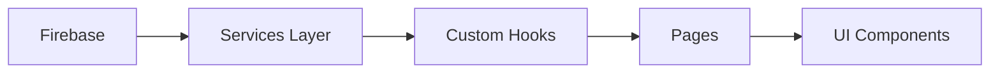
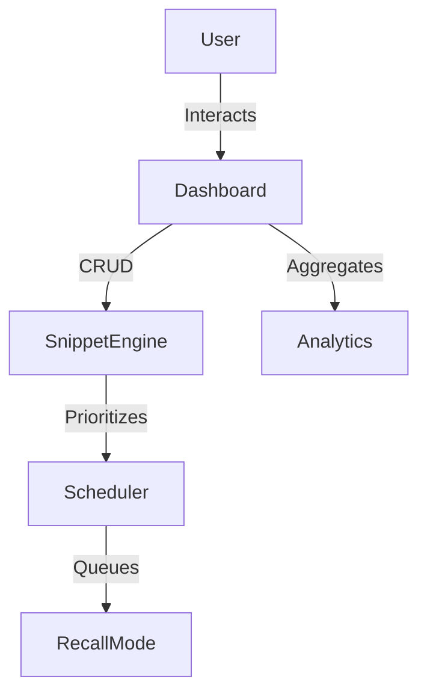
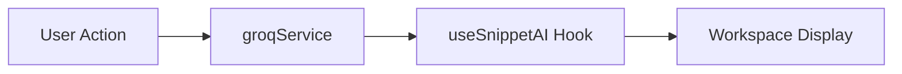

# CodeRecall

CodeRecall is a developer learning platform that helps programmers retain technical knowledge using spaced repetition and AI-generated explanations. Most developers solve complex bugs only to forget the specific patterns weeks later; this tool centralizes those solutions and schedules them for revision to ensure long-term mastery. By integrating the Groq API (Llama 3), it provides instant conceptual clarity, transforming a simple snippet list into an active recall study system.

Unlike traditional snippet managers, CodeRecall actively schedules revision sessions instead of passively storing code.

## Project Objective

The goal of CodeRecall is to optimize developer productivity by applying learning science to code management. It uses a priority-based spaced repetition algorithm to ensure developers revisit their most difficult snippets at the right time, while AI explanations bridge the gap between "working code" and "conceptual understanding."

## Problem Statement

Developers often forget solutions they have already implemented, leading to redundant work and "re-googling" the same bugs. Standard notes are often scattered across Gists, bookmarks, or Notion, making revision inefficient and uncoordinated. CodeRecall addresses this by providing an intelligent, scheduled practice environment that automates technical revision.

## Features

- **Authentication**: Firebase-powered login and signup with protected dashboard routes.
- **Snippet Workspace**: Full CRUD engine to save, edit, and organize snippets with syntax highlighting.
- **Recall Mode**: Intelligent learning queue that prioritizes snippets based on past performance.
- **AI Explanation Engine**: Near-instant breakdown of code logic using the Groq (Llama 3) model.
- **Analytics Dashboard**: Visual progress tracking including learning streaks and category mastery.

## How CodeRecall Works (Quick Flow)

Save snippet → Generate AI explanation → Practice in Recall Mode → Track progress in Analytics

## Tech Stack

### Frontend
- React
- React Router v6
- Vite

### Backend / Services
- Firebase Authentication
- Firestore (NoSQL Database)
- Groq AI API (Llama 3)

## Architecture Summary

The project follows a modular React architecture using pages, services, hooks, and reusable components to separate UI from business logic.

## Project Structure

- **src/pages**: Route-level components for views like Landing, Login, and Dashboard.
- **src/components**: Feature-specific UI modules (Workspace, Recall Queue).
- **src/components/common**: Generic elements like loaders and the ErrorBoundary.
- **src/hooks**: Stateful logic abstractions (e.g., `useSnippetAI`, `useAuthListener`).
- **src/services**: Infrastructure layer for Firebase and Groq operations.

The architecture separates infrastructure logic from UI rendering using services and custom hooks.

### Architecture Flow

## Routing Architecture

CodeRecall uses **React Router v6** for deep-link persistent navigation and route guarding.
- **Nested Dashboard Routes**: Users can switch between workspace sections without reloading the page.
    - `/dashboard/snippets` - Workspace
    - `/dashboard/recall` - Study Mode
    - `/dashboard/analytics` - Insights
    - `/dashboard/settings` - Config
- **ProtectedRoute**: A higher-order component that checks the Firebase auth state before granting access to the dashboard.

## Recall Mode Logic

The Recall Scheduler uses a priority-based logic to optimize retention:
- **Priority Queue**: Snippets are resurfaced based on their "Recall Priority" score.
- **Feedback Loop**: When a user marks a snippet as "Mastered," its priority drops; if marked "Revisit," it is moved to the front.
- **Spaced Repetition**: Weak snippets appear more frequently, while strong snippets are spaced further apart to challenge long-term memory.

### System Flow Diagram

## AI Integration

AI explanations are integrated directly into the study workflow to improve code comprehension.
- **Groq API**: Uses Llama 3 for low-latency code analysis.
- **useSnippetAI**: A custom hook that isolates API communication from the UI.
- **Contextual Notes**: Results are rendered inside an accordion for easy reference during study.

### AI Pipeline Diagram

## Performance Optimizations

- **Lazy Loading**: Route-splitting via `React.lazy` to keep the initial bundle small.
- **Suspense**: A centralized loader handles the UI state during route transitions.
- **Memoization**: `useMemo` and `useCallback` prevent redundant calculations and re-renders in the complex dashboard workspace.

## Screenshots

- **Dashboard Workspace View**: [Placeholder: Grid of snippets with filters]
- **Recall Mode Interface**: [Placeholder: Learning queue with priority cards]
- **Analytics Panel**: [Placeholder: Activity graphs and streaks]

## Setup Instructions

Ensure you have a Firebase project (with Firestore and Auth enabled) and a Groq API key before starting.

1. Clone the repository.
2. `npm install`
3. Create a `.env` file based on `.env.example`.
4. Add your Firebase config and Groq API key to `.env`.
5. `npm run dev`

## Future Improvements

- **Offline Caching**: Support for snippet review without internet.
- **Collaborative Decks**: Peer-to-peer sharing of snippet collections.
- **Mobile Optimization**: Progressive Web App (PWA) support.
- **Adaptive Scoring**: Finer-grained priority weights based on review speed.

## Author Note

This project was developed as part of a React end-term submission focused on applying learning science concepts to frontend architecture design.
