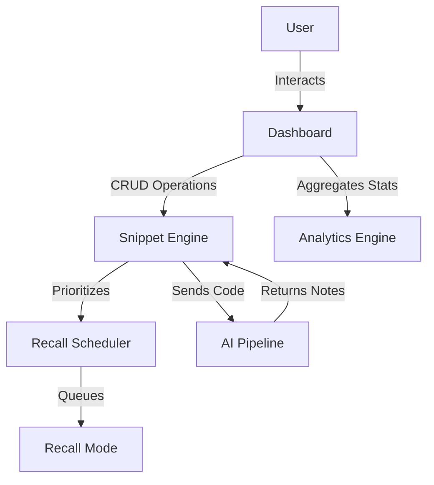

# CodeRecall

CodeRecall is a developer-focused learning platform designed to bridge the gap between solving a technical problem and retaining that solution long-term. In the fast-paced world of software development, engineers often solve complex bugs or implement intricate algorithms only to forget the specific logic weeks later. CodeRecall solves this by applying spaced repetition principles directly to code snippets, supplemented by AI-generated explanations that help reinforce the "why" behind the code. By automating the revision process and centralizing scattered notes, the platform ensures that developers build a persistent and accessible knowledge base of their own solutions.

## Project Objective

The primary purpose of CodeRecall is to optimize the cognitive load of developers by automating knowledge retention. It helps developers retain solutions by scheduling revision sessions for saved snippets at scientifically backed intervals. Spaced repetition is applied to code snippets because programming logic is prone to "mental decay" if not revisited. Furthermore, the integration of AI explanations using the Groq API (Llama 3) ensures that when a user revisits a snippet, they don't just see the code—they receive a contextual breakdown that improves their conceptual understanding and reduces the time required to re-master the logic.

## Problem Statement

Developers frequently suffer from "developer amnesia," where they find themselves re-googling or re-asking the same questions they solved previously. Current note-taking methods like scattered markdown files, gist repositories, or browser bookmarks lack a proactive revision system. Revision is often inefficient because it is not prioritized; developers either spend time reviewing master logic or completely ignore complex concepts until they are needed again. Practice is rarely scheduled intelligently, leading to a shallow understanding of critical patterns. CodeRecall addresses this by transforming a passive list of snippets into an active, feedback-based learning engine that resurfaces difficult material more frequently than mastered content.

## Screenshots

*Screenshots placeholders for evaluator review:*
- **Dashboard Workspace View**: A centralized grid of all saved code snippets with filtering and search.
- **Recall Mode Interface**: The active learning queue where users test their knowledge and receive AI feedback.
- **Analytics Panel**: Visual insights into learning progress, streaks, and category-wise mastery.

## Features

### Authentication
- **Firebase Auth Integration**: Secure login and signup flows using Firebase Authentication.
- **Protected Routing**: Navigation guards ensure that only authenticated users can access the dashboard and learning workspace.

### Snippet Workspace
- **CRUD Operations**: Comprehensive engine to save, view, edit, and delete code snippets with syntax highlighting.
- **Categorization & Search**: Organize snippets by language or topic and locate them instantly via the unified search bar.

### Recall Mode
- **Priority Learning Queue**: An intelligent queue that orders snippets based on their recall history.
- **Spaced Repetition Scheduling**: Automated scheduling that determines the optimal time for the next revision.
- **Reinforcement Loop**: A feedback system that updates the "streak" and "priority" of each snippet based on user performance.

### AI Explanation Engine
- **Groq API Integration**: Leverages high-speed Llama 3 models for near-instant explanation generation.
- **Contextual Learning**: Generates structured notes and explanations inside the workspace to provide immediate learning support.

### Analytics Dashboard
- **Activity Insights**: Track the total number of snippets mastered and current learning streaks.
- **Visibility**: Visual breakdown of snippet priority across different categories to identify knowledge gaps.

## Tech Stack

### Frontend
- **React**: Core library for building the declarative UI.
- **React Router v6**: Manages complex navigation and nested route structures.
- **Vite**: Modern build tool for optimized development and production bundles.

### Backend / Services
- **Firebase Authentication**: Managed identity service for secure user access.
- **Firestore Database**: NoSQL real-time database for snippet storage and user analytics.
- **Groq API (Llama 3)**: LLM inference engine for generating code explanations.

### Architecture
- **Custom Hooks**: Abstraction layer for complex stateful logic (Auth, AI, Snippets).
- **Services Layer**: Decoupled infrastructure for Firebase and Groq operations.
- **ErrorBoundary**: Class-based component for catching and handling runtime rendering crashes.
- **Lazy Loading**: Route-based code splitting for improved performance.

## Project Structure

The project follows a modular architecture designed for scalability and clear separation of concerns:
- **src/pages**: Contains route-level components (Landing, Login, Dashboard) that define the layout for specific URLs.
- **src/components**: Stores reusable UI modules.
- **src/components/common**: Generic, project-wide components like Loaders and the ErrorBoundary.
- **src/hooks**: Custom React hooks (e.g., `useSnippetAI`, `useAuthListener`) that encapsulate business logic away from the UI.
- **src/services**: The infrastructural layer that talks to Firebase and Groq API.

### Design Decisions
- **Services Layer**: Chosen to ensure that if the AI provider or Database changes, only one folder needs modification, not the entire UI.
- **Custom Hooks**: Used to promote the DRY (Don't Repeat Yourself) principle, allowing any component to access Auth or AI logic easily.
- **Pages Folder**: Separates "where" the user is (Route) from "what" they are seeing (Component).
- **Common Folder**: Ensures that generic utility components are centralized for consistent styling and behavior.

## Routing Architecture

CodeRecall utilizes **React Router v6** to manage a multi-page experience within a Single Page Application.
- **Nested Dashboard Routes**: The dashboard uses a relative routing structure to switch between specialized views without full page reloads.
    - `/dashboard/snippets` - Main workspace
    - `/dashboard/recall` - Active learning mode
    - `/dashboard/analytics` - Progress tracking
    - `/dashboard/settings` - User configuration
- **ProtectedRoute Logic**: A specialized wrapper component checks the Firebase auth state before rendering children. If unauthenticated, it redirects to `/login`.
- **Deep-Link Persistence**: The routing is designed to handle browser refreshes gracefully, maintaining the user position and session state.

## State Flow Design

Data in CodeRecall follows a clean, unidirectional flow:
1. **Firebase**: The source of truth for snippets and auth state.
2. **Services**: Fetches raw data and formats it for the app.
3. **Hooks**: Manage local state, loading indicators, and error states.
4. **Pages**: Orchestrate the layout based on hook data.
5. **UI Components**: Present the data to the user.

Using **hooks as an abstraction** improves maintainability because individual UI components don't need to know how to talk to Firebase; they simply request data from the hook.

## AI Pipeline Design

The integration with Groq for AI-generated notes follows a specific pipeline:
1. **User Action**: User selects a snippet and clicks "Generate Notes."
2. **Service Request**: The request is sent to `groqService.js` with the code content and a specialized system prompt.
3. **Hook Handling**: `useSnippetAI` manages the asynchronous state (loading, error, result).
4. **Rendering**: The result is parsed and rendered into a structured accordion inside the workspace.

## Recall Mode Algorithm

The Core of CodeRecall is its Spaced Repetition scheduler.
- **Priority Queue**: Snippets are not shown randomly; they are ordered by their "Recall Priority" and "Streak."
- **Internal Logic**: When a user marks a snippet as "Mastered," its priority decreases, and its next appearance is delayed. If marked as "Revisit," the priority increases, moving it to the front of the queue.
- **Reinforcement Behavior**: By resurfacing weak snippets more frequently, the algorithm forces active recall of the hardest material, which is the most effective way to improve long-term retention.

## System Flow Diagram



The diagram illustrates how the User interacts with the Dashboard, which then acts as a hub for the Snippet Engine and Analytics. The Snippet Engine feeds code to the AI Pipeline and timing data to the Recall Scheduler.

## Error Handling Strategy

- **ErrorBoundary**: The Dashboard is wrapped in a class-based Error Boundary that catches runtime rendering errors and offers a "Reload" fallback UI to prevent total app failure.
- **Auth Fallbacks**: `ProtectedRoute` handles various auth edge cases, ensuring users don't see broken states if the Firebase connection is slow.
- **Loading States**: Consistent use of the `Loading` component ensures the user is never left with a blank screen during data fetching or auth initialization.

## Performance Optimization

- **React.lazy**: Public and private pages are lazy-loaded to reduce the initial JavaScript bundle size.
- **Suspense**: A centralized fallback loader manages the visual transition while components are being fetched.
- **useMemo / useCallback**: Critical functions and sorted lists (like the Recall Queue) are memoized to avoid redundant calculations on every render.

## Environment Setup

To run CodeRecall locally, you must first set up the required environment variables.
- **Deployment Readiness**: You will need an active Firebase project with Firestore and Authentication enabled, along with a Groq API key from the Groq Cloud Console.

### Setup Steps
1. Clone the repository to your local machine.
2. Install dependencies using `npm install`.
3. Create a `.env` file in the root directory based on the `.env.example` template.
4. Input your Firebase configuration keys and Groq API key into the `.env` file.
5. Run the development server.

## Running the Project

Open your terminal in the project root and run:
```bash
# Install dependencies
npm install

# Launch development server
npm run dev
```

## Future Improvements

- **Offline Caching**: Implementing Service Workers to allow snippet access and learning without an internet connection.
- **Collaborative Features**: Allowing users to share snippet "decks" with peers.
- **Mobile App**: Porting the React web app into a Capacitor-based mobile experience.
- **Adaptive Scoring**: Using more advanced Spaced Repetition algorithms (like SM-2) for finer-grained scheduling.

## Author Note

This project was built as part of a React end-term submission and focuses on applying learning science concepts to developer productivity tools. It seeks to demonstrate a professional approach to frontend architecture, state management, and external API integration in a real-world scenario.
