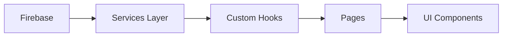
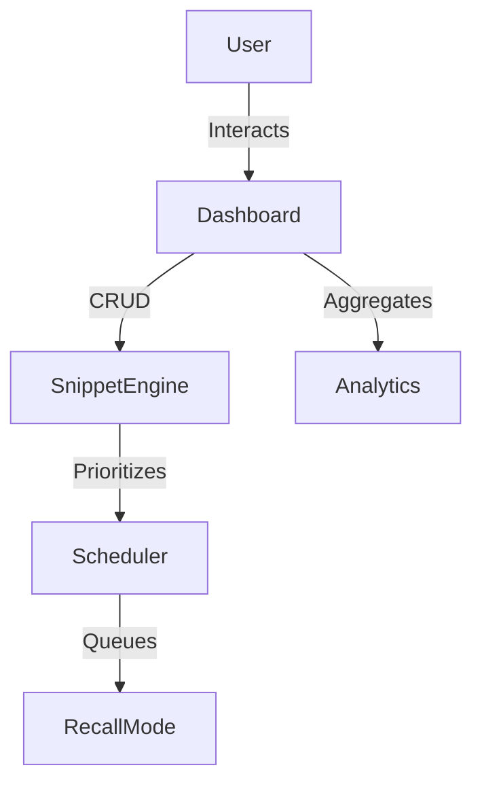
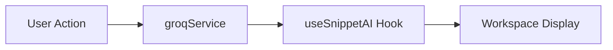
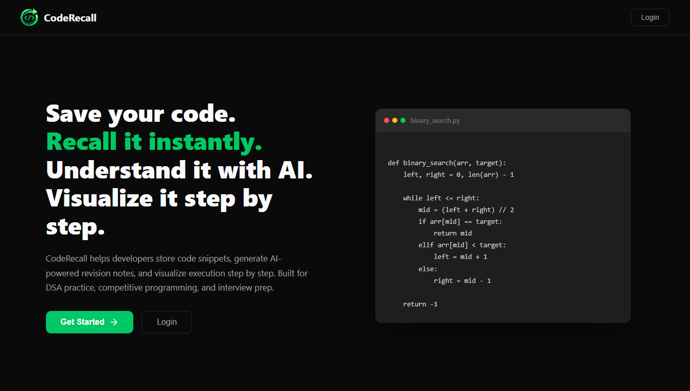
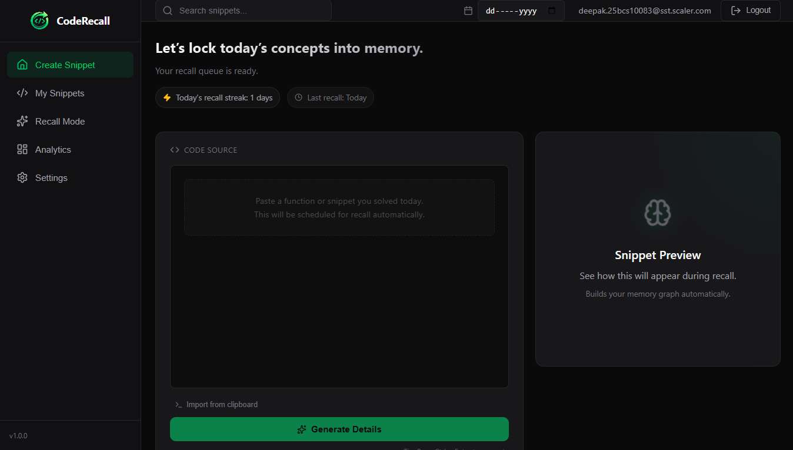
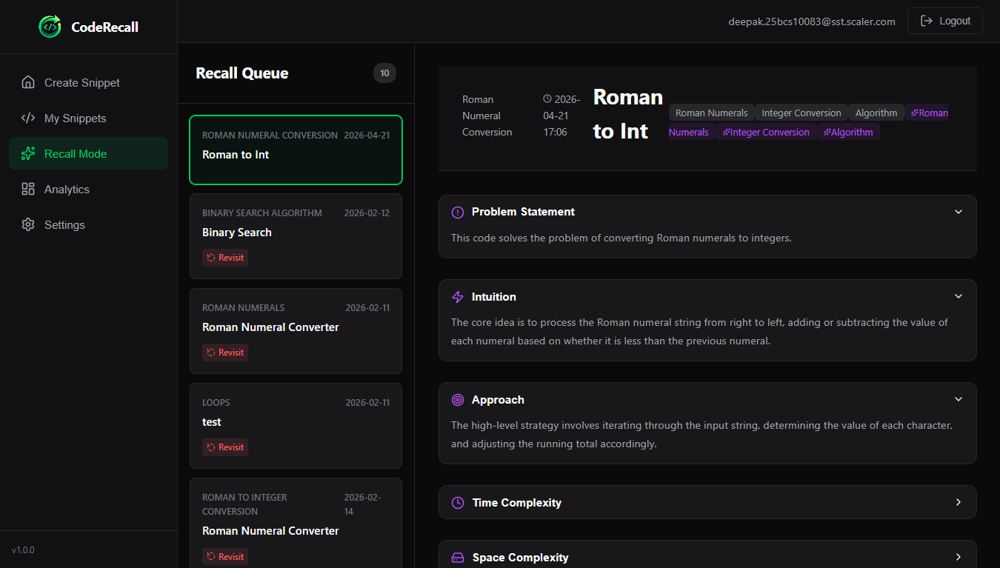
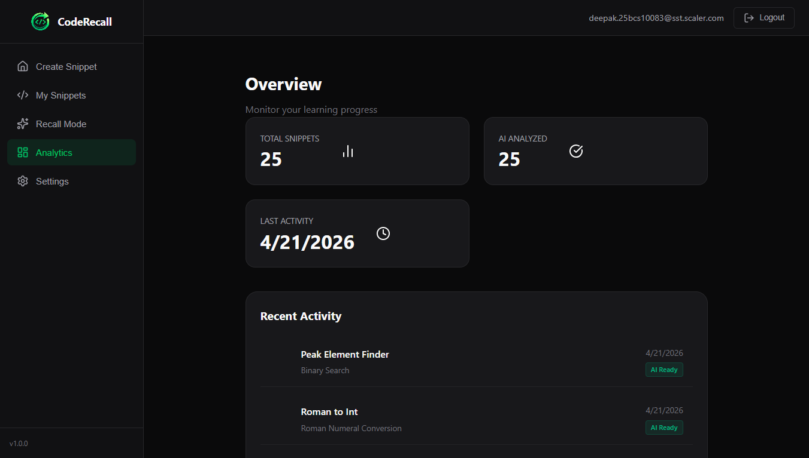

# CodeRecall 📖

CodeRecall is a developer learning platform that helps programmers retain technical knowledge using spaced repetition and AI-generated explanations. Most developers solve complex bugs only to forget the specific patterns weeks later; this tool centralizes those solutions and schedules them for revision to ensure long-term mastery.

[Overview](#coderecall-) · [Features](#-features) · [Tech Stack](#-tech-stack) · [Architecture](#-architecture) · [Routing](#-routing-architecture) · [Recall Mode](#-recall-mode-logic) · [AI Integration](#-ai-integration) · [Setup](#-setup-instructions) · [Future Work](#-future-improvements)

## Why CodeRecall is different

Standard snippet managers act as passive storage for code, often leading to a "save and forget" cycle. In contrast, CodeRecall applies learning science to developer productivity:
- **Active Scheduling**: Instead of just storing code, it schedules revision sessions based on performance.
- **AI Reinforcement**: Integrated AI explanations provide conceptual "why" behind the "how," strengthening retention.
- **Priority Logic**: A weighted queue ensures your weakest areas are resurfaced more frequently.

## How CodeRecall works

**Save snippet** → **Generate explanation** → **Practice recall** → **Track progress**

---

## ✨ Features

### Authentication
- **Secure Access**: Firebase-powered login and signup identity management.
- **Protected Environment**: Navigation guards ensure data privacy and session security.

### Snippet Workspace
- **Dynamic CRUD**: Comprehensive engine to save, edit, and organize snippets with full syntax highlighting.
- **Instant Retrieval**: Unified search bar and language-based categorization for fast access.

### Recall Mode
- **Intelligent Queue**: A priority-based learner that resurfaces snippets at optimal intervals.
- **Feedback Reinforcement**: Update snippet mastery levels (Mastered/Revisit) to adjust scheduling scores.

### AI Explanation Engine
- **Conceptual Clarity**: Near-instant breakdown of complex logic using High-Speed Llama 3 models.
- **Contextual Support**: Structured notes rendered directly inside the workspace for reference during study.

### Analytics Dashboard
- **Performance Insights**: Visual tracking of learning streaks and total snippet mastery.
- **Knowledge Mapping**: Category-wise priority distribution to identify learning gaps.

---

## 🛠️ Tech Stack

| Layer | Technology |
| :--- | :--- |
| **Frontend** | React, Vite |
| **Routing** | React Router v6 |
| **Backend** | Firebase Auth + Firestore |
| **AI** | Groq (Llama 3) |
| **Architecture** | Custom Hooks + Services Layer |

---

## 🧱 Architecture

The architecture separates infrastructure logic from UI rendering using a modular services and custom hooks pattern.

### Architecture Flow


**Design Decisions:**
- **Services Layer**: Isolates external API logic (Firebase/Groq) for easy future provider migration.
- **Custom Hooks**: Encapsulates stateful business logic, keeping UI components pure and reusable.
- **Directory Structure**: Clear separation between `/pages` (routes) and `/components` (UI modules).

---

## 🧭 Routing Architecture

CodeRecall utilizes **React Router v6** for deep-link persistent navigation and authenticated guarding.

- **Nested Routing**: Sub-views are managed within the dashboard for a seamless UX without full page reloads.
    - `/dashboard/snippets` (Workspace)
    - `/dashboard/recall` (Study)
    - `/dashboard/analytics` (Insights)
    - `/dashboard/settings` (Config)
- **ProtectedRoute**: A higher-order component logic that validates auth state before rendering restricted views.

---

## 🧠 Recall Mode Logic

The Recall Scheduler uses a priority-based logic to optimize knowledge retention through active reinforcement.

### System Flow Diagram


**Internal Logic:**
- **Priority-Based Resurfacing**: Snippets with low "streak" or high "revisit" counts are prioritized.
- **Spaced Spacing**: Mastered snippets appear less often, while weak snippets are surfaced more frequently to challenge memory.

---

## 🤖 AI Integration

AI explanations are integrated into the study workflow to bridge code implementation and conceptual understanding.

### AI Pipeline Diagram


- **Groq Integration**: Leverages low-latency Llama 3 for instant analytical feedback.
- **Logic Isolation**: The `useSnippetAI` hook handles all asynchronous states and error handling for the UI.

---

## ⚡ Performance

- **Lazy Loading**: Route-based splitting using `React.lazy` to minimize initial bundle size.
- **Suspense**: Centralized loading state management during route transitions.
- **Memoization**: Heavy sorting and filtering logic optimized via `useMemo` and `useCallback`.
- **Stability**: `ErrorBoundary` wrapping the main dashboard to prevent total application failure.

---

## 📸 Application Screenshots

| Landing Page                        | Dashboard Workspace                   |
| ----------------------------------- | ------------------------------------- |
|  |  |

| Recall Mode                             | Analytics View                        |
| --------------------------------------- | ------------------------------------- |
|  |  |

### Landing Page
Introduces the platform and highlights the AI-assisted recall workflow.

### Dashboard Workspace
Central snippet storage and preview interface with filtering support.

### Recall Mode
Priority-based learning queue powered by spaced repetition logic.

### Analytics View
Displays snippet activity insights and revision progress tracking.

---

## 🚀 Setup Instructions

1. **Clone & Install**:
   ```bash
   git clone https://github.com/DeeKush/Code-Recall.git
   npm install
   ```
2. **Environment Configuration**:
   - Create a `.env` file based on `.env.example`.
   - Configure Firebase project (Firestore + Auth enabled).
   - Add Groq API Key for AI features.
3. **Run Locally**:
   ```bash
   npm run dev
   ```

---

## 🔮 Future Improvements

- **Offline Support**: PWA with Service Worker integration for offline snippet review.
- **Collaborative Features**: Shared snippet "decks" for peer learning teams.
- **Mobile Experience**: Optimized mobile-first touch UI for "on-the-go" recall.
- **Advanced Scoring**: Implementation of SM-2 algorithm for precise scheduling.

---

## 📄 Author Note

This project was developed as part of a React end-term submission focused on applying learning science concepts to frontend architecture design.
