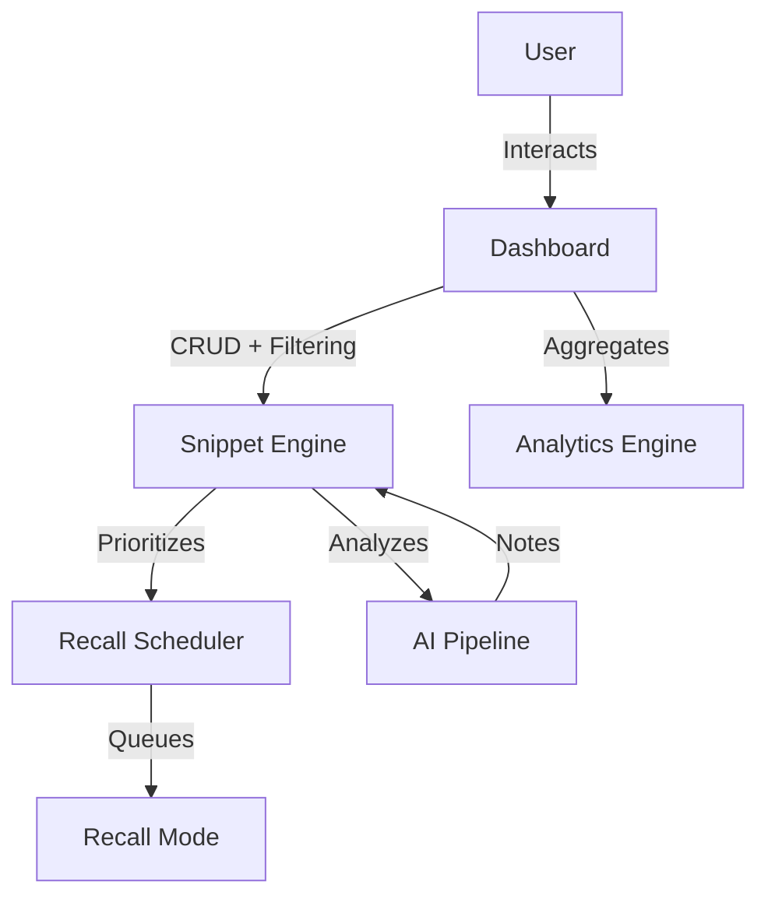

# CodeRecall 🧠

**AI-Assisted Spaced Repetition for Developers.**

CodeRecall is a specialized snippet manager designed to helping developers internalize complex algorithms, design patterns, and tricky syntax through active recall and AI-powered insights.

## ✨ Features

- **Smart Snippet Management**: Organize code with AI-generated titles, topics, and tags.
- **AI-Powered Insights**: Auto-generates intuition, time complexity, and edge cases for every snippet using Groq (Llama 3).
- **Code Visualizer**: Step-by-step execution visualization for Java and C++ algorithms to build mental models.
- **Recall Mode (Spaced Repetition)**: Active recall sessions with "blur" mode to test your memory. Tracks streaks and "understood" vs "revisit" status.
- **Multi-Key AI Fallback**: Robust AI client that rotates through multiple API keys to ensure high availability.
- **Mobile-Responsive Dashboard**: Full feature parity on mobile devices for on-the-go review.

## 🛠️ Tech Stack

- **Frontend**: React, Vite
- **Styling**: Vanilla CSS (Custom Design System, Dark Mode)
- **Backend/Auth**: Firebase (Firestore, Authentication)
- **AI**: Groq API (Llama 3-70b), OpenRouter fallback
- **Visualizer**: Custom execution engine + AI parsing

## 📅 The 7-Day Build Sprint

This project was built in an intense 7-day sprint to go from idea to polished product.

- **Day 1: Foundation & Auth**
  - Project initialization with Vite + React.
  - Implemented Firebase Authentication (Google/GitHub).
  - Designed the core data schema in Firestore.

- **Day 2: Core Storage Engine**
  - Built robust Firestore utilities for CRUD operations.
  - Implemented `utils/storage.js` with optimistic UI updates.
  - Created the initial "Add Snippet" flow.

- **Day 3: AI Integration (Gemini/Groq)**
  - Integrated Large Language Models to analyze code.
  - Implemented automatic metadata generation (Title, Topic, Tags).
  - Built the "AI Explain" feature to generate detailed code notes.

- **Day 4: The Dark Dashboard**
  - Complete UI overhaul to a professional "Dark Mode" aesthetic.
  - Designed the 3-pane dashboard layout (Sidebar, List, Detail).
  - Implemented the sticky top bar and responsive grid.

- **Day 5: Robustness & Fallbacks**
  - Implemented `utils/groq.js` with a cascading API key fallback system.
  - Added request timeouts and error handling for reliable AI performance.
  - Refined the "Recall Mode" logic for active learning sessions.

- **Day 6: Algorithm Visualizer**
  - Built the `CodeVisualizer` engine to parse and step through code.
  - Added AI-generated test inputs for dynamic visualization.
  - Focused on visualizing Java and C++ pointer/array logic.

- **Day 7: Productization & Polish**
  - Final UI consistency sweep (Padding, Radius, Colors).
  - Mobile optimization for all views.
  - Added logo/branding execution.
  - Prepared for strict "Launch Day" stability checks.

## 🚀 Setup & Run

1. **Clone the repo**
   ```bash
   git clone https://github.com/DeeKush/Code-Recall.git
   cd Code-Recall
   ```

2. **Install Dependencies**
   ```bash
   npm install
   ```

3. **Configure Environment**
   Create a `.env` file with your keys:
   ```env
   VITE_FIREBASE_API_KEY=...
   VITE_GROQ_API_KEY=...
   ```

4. **Run Locally**
   ```bash
   npm run dev
   ```

5. **Build for Production**
   ```bash
   npm run build
   ```

## 🏗️ Architecture Overview

CodeRecall is designed with a modular, scalable architecture to ensure high maintainability and academic excellence.

### Project Structure
- **`/pages`**: Isolated view-level components that correspond to specific routes. This separation separates the UI layout from general business logic.
- **`/components`**: Reusable UI blocks categorized into `common` (generic) and feature-specific modules (e.g., `auth`, `SnippetWorkspace`).
- **`/services`**: A dedicated infrastructural layer for external integrations like Firebase (Storage/Auth) and Groq (AI). This ensures that business logic is decoupled from specific API implementation details.
- **`/hooks`**: Custom abstractions (e.g., `useSnippetAI`, `useAuthListener`) that encapsulate complex stateful logic, promoting DRY (Don't Repeat Yourself) principles.

### Routing Strategy
Powered by **React Router v6**, the application implements:
- **Nested Routes**: Dashboard-specific views are handled via sub-routes (e.g., `/dashboard/snippets`), supporting deep linking.
- **Protected Routes**: A specialized `ProtectedRoute` component guards access, enforcing authentication states before rendering restricted views.
- **Lazy Loading**: Code-splitting via `React.lazy` ensures minimal initial bundle size and faster page loads.

### State Flow Design
Data flows through a predictable unidirectional pipeline:
`Firebase (Cloud)` → `Service Layer (fetch/parse)` → `Custom Hooks (state management)` → `Pages (view layout)` → `UI Components (presentation)`.

### AI Integration Pipeline
1. **Snippet Selection**: User selects or creates a snippet.
2. **Analysis Request**: The workspace triggers a call through `useSnippetAI`.
3. **API Processing**: `groqService` handles communication with the Llama 3 model, including cascading fallback logic.
4. **Result Rendering**: The AI response is structured and rendered into the `NoteAccordion` system.

### Recall Algorithm Logic
The application uses a **Weighted Spaced Repetition** logic:
- **Queue Scheduling**: Snippets are prioritized based on their "Recall Streak".
- **Priority Resurfacing**: Snippets marked as "Revisit" are moved to the front of the queue.
- **Reinforcement**: Persistent streak tracking ensures users focus on difficult material while reinforcing mastered content.

## 📊 System Flow Diagram



**Workflow Explanation:**
- **User Interface**: Interacts with the dashboard workspace for all operations.
- **Snippet Engine**: Manages the core lifecycle of code snippets, including Firestore syncing and local filtering.
- **Recall Scheduler**: Specifically prioritizes the learning queue based on spaced-repetition metrics.
- **Analytics Engine**: Aggregates performance insights (streaks, counts) to visualize progress.

## 📄 License
MIT
